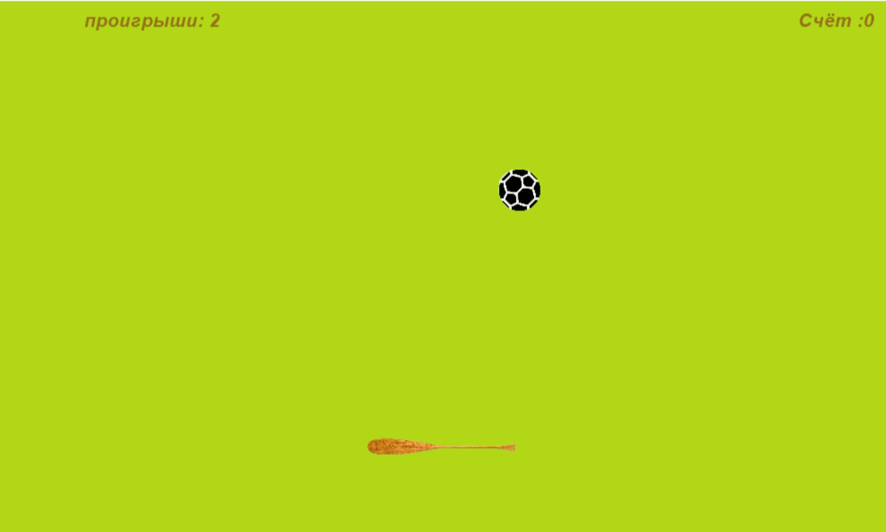
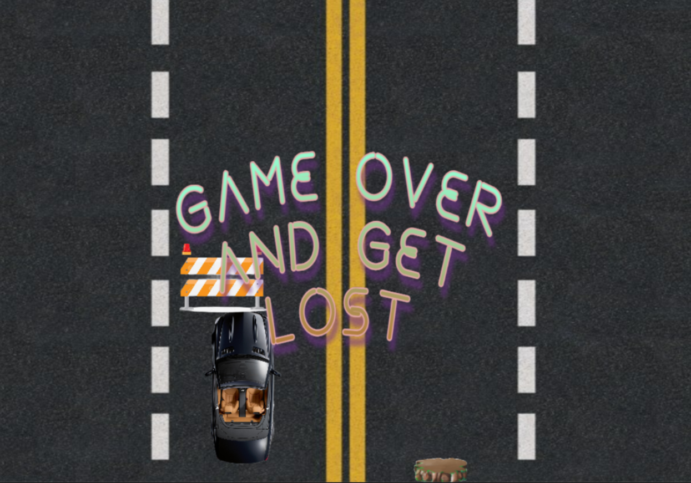
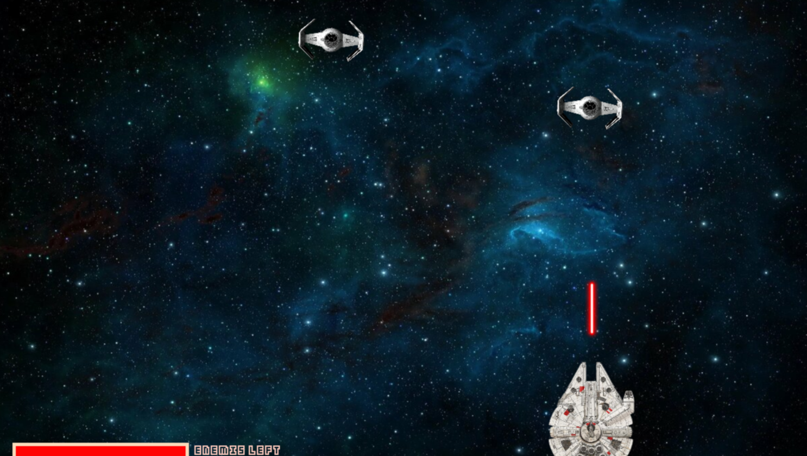

# Игры, реализованные на языке Python
## Ping-pong 

**Цель игры** - отбить мяч 20 раз. При этом мяч в разные промежутки времени может сменить свою траекторию на случайную.

**Управление** - a-d или стрелки влево-вправо для движения ракетки влево или вправо.

## Races

**Цель игры** - Продержаться 1 минуту, не врезаясь в движующиеся на встречу в препятствия.

**Управление** - a-d или стрелки влево-вправо для движения машины влево или вправо.
## Star wars

**Цель игры** - Управляй знаменитым Соколом Тысячелетия, который продирается сквозь рой вражеских СИД-истребителей! Твоя задача - уничтожить их всех, не попадая под огни имперских кораблей. 

**Управление** - влево и вправо по движению мышки, ЛКМ - стрелять

